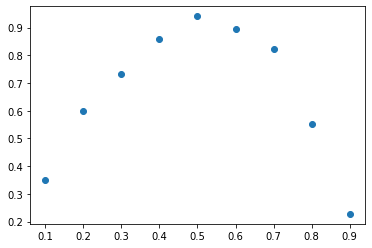

Solving Data-Constrained FEM Problems with Firedrake and stat-fem
=================================================================

Eric Daub, Research Engineering Group, Alan Turing Institute

(Theory due to Mark Girolami, Cambridge)

Talk given at the `Firedrake ’21 Conference
(Virtual) <https://firedrakeproject.org/firedrake_21.html>`__, September
2021 and slightly modified to be a standalone part of documentation.

.. code:: python3

    import numpy as np
    from firedrake import UnitIntervalMesh, FunctionSpace, TrialFunction, TestFunction
    from firedrake import SpatialCoordinate, dx, Function, DirichletBC, solve
    from firedrake import dx, pi, sin
    import matplotlib.pyplot as plt
    from scipy.stats import multivariate_normal
    from stat_fem.covariance_functions import sqexp

.. parsed-literal::

    firedrake:WARNING Could not find BLAS library!
    firedrake:WARNING OMP_NUM_THREADS is not set or is set to a value greater than 1, we suggest setting OMP_NUM_THREADS=1 to improve performance

**Note:** This cell was not part of the talk as it defined the
mis-specified FEM that was solved as part of the example.

.. code:: python3

    def measurement(measure_pts, error):
        assert error > 0.
        assert np.all(np.array(measure_pts) > 0.)
        assert np.all(np.array(measure_pts) < 1.)
        nx = 101
    
        mesh = UnitIntervalMesh(nx - 1)
        V = FunctionSpace(mesh, "CG", 1)
    
        u = TrialFunction(V)
        v = TestFunction(V)
    
        x = SpatialCoordinate(mesh)
        xp = Function(V)
        xp.interpolate(x[0])
    
        xvals = np.reshape(xp.vector().dat.data, (-1, 1))
    
        np.random.seed(24435)
        fvals = multivariate_normal.rvs(size=1,
                                        mean=np.pi*np.pi*np.sin(np.pi*xvals.flatten()),
                                        cov=sqexp(xvals, xvals, -1., -4.))
    
        f = Function(V, val=fvals)
    
        a = (u.dx(0)*v.dx(0) + u*v) * dx
        L = f*v*dx
    
        bc = DirichletBC(V, 0., "on_boundary")
    
        u1 = Function(V)
    
        solve(a == L, u1, bcs=[bc])
    
        return np.random.normal(size=len(measure_pts),
                                loc=u1.at(measure_pts),
                                scale=error)

Data and FEM models
-------------------

How do we use data to inform/constrain FEM models in a manner that
respects different types of uncertainties, does not overfit data, and is
computationally efficient?

Simple example solving the time-independent heat equation in 1D. Imagine
that we go into the laboratory and heat a 1D material and measure the
resulting temperature. We might get something that looks like the
following:

.. code:: python3

    %matplotlib inline
    import matplotlib.pyplot as plt
    
    pts = [0.1*float(x) for x in range(1, 10)]
    error = 5.e-2
    data = measurement(pts, error)
    plt.plot(pts, data, "o");

Firedrake solution
------------------

Straightforward to solve the underlying PDE using Firedrake on a unit
interval mesh using piecewise-linear basis functions and compare with
data (which we plot with error bars this time). Rather than returning
the solution, I return the assembled linear system and function space
used to construct the solution as I will need these later to carry out
the statistical FEM solution.

.. code:: python3

    from firedrake import UnitIntervalMesh, FunctionSpace, TrialFunction, TestFunction
    from firedrake import SpatialCoordinate, Function, DirichletBC, assemble, solve
    from firedrake import dx, pi, sin, plot
    
    def generate_assembled_fem():
    
        nx = 101
    
        mesh = UnitIntervalMesh(nx - 1)
        V = FunctionSpace(mesh, "CG", 1)
    
        u = TrialFunction(V)
        v = TestFunction(V)
    
        x = SpatialCoordinate(mesh)
        f = Function(V)
        f.interpolate(pi*pi*sin(pi*x[0]))
    
        a = u.dx(0)*v.dx(0)*dx
        L = f*v*dx
    
        bc = DirichletBC(V, 0., "on_boundary")
    
        A = assemble(a, bcs=bc)
        b = assemble(L)
        
        return V, A, b

.. code:: python3

    def plot_solution(u, pts, data, error):
    
        fig = plt.figure()
        ax = plt.axes()
        plt.errorbar(pts, data, yerr=error, fmt="o")
        plot(u, axes=ax)
    
    V, A, b = generate_assembled_fem()
    u = Function(V)
    solve(A, u, b)
    plot_solution(u, pts, data, 2.*error)

Model and data disagree
-----------------------

The model and the data are somewhat different – too many points lie far
from the FEM solution. We know the uncertainty in the data, what about
the model?

-  Could we have the wrong thermal conductivity?
-  Forcing of the heated material might be different than we guessed?
-  Are we solving the wrong equation?

How do we account for these in a principled way that respects
uncertainties?

Add a fitting parameter
-----------------------

What people often do: RHS is probably uncertain, so we should just add a
fitting parameter. This can be done in a straightforward manner using
Maximum Likelihood Estimation.

.. code:: python3

    def solve_heat_freeparam(coeff):
    
        assert coeff > 0.
        nx = 101
    
        mesh = UnitIntervalMesh(nx - 1)
        V = FunctionSpace(mesh, "CG", 1)
    
        u = TrialFunction(V)
        v = TestFunction(V)
    
        x = SpatialCoordinate(mesh)
        f = Function(V)
        f.interpolate(coeff*pi*pi*sin(pi*x[0]))
    
        a = u.dx(0)*v.dx(0)*dx
        L = f*v*dx
    
        bc = DirichletBC(V, 0., "on_boundary")
    
        u = Function(V)
    
        solve(a == L, u, bcs=[bc])
        
        return u

.. code:: python3

    import numpy as np
    from scipy.optimize import minimize
    
    def mle_estimation(pts, data, error):
    
        def loglikelihood(coeff, pts, data, error):
            new_coeff = np.exp(coeff)[0]
            u = solve_heat_freeparam(new_coeff)
            soln = u.at(pts)
            return 0.5*np.sum((soln - data)**2/error**2)
    
        result = minimize(loglikelihood, 0., args=(pts, data, error))
        
        coeff = np.exp(result["x"][0])
    
        print("MLE result: {}".format(coeff))
        print("Number of FEM solves: {}".format(result['nfev']))
    
        u = solve_heat_freeparam(coeff)
        plot_solution(u, pts, data, 2.*error)

.. code:: python3

    mle_estimation(pts, data, error)

.. parsed-literal::

    MLE result: 0.9442305553763476
    Number of FEM solves: 14

Are we any better off?
----------------------

Maybe – the model fits the data better, but we added a free parameter.
Were we justified in adding that free parameter? Does its value respect
the uncertainties in the equation and the base physical system that we
are studying?

A better approach is what follows, where we actually try to account for
the uncertainty in our numerical model. I’ll look at the impliciations
of an uncertain RHS of the governing equation, but we can equally do the
same for the thermal conductivity.

FEM with uncertain RHS
----------------------

We can capture uncertainty information about the FEM by describing the
RHS of our system as a Gaussian Process. A Gaussian Process is a
distribution over *functions* with known mean and covariance:

.. math::  \nabla^2 u = - f

Where :math:`f \sim \mathcal{GP}(\bar{f}(x), c(x, x))`. This is like a
probability distribution, with the random variates being functions
rather than variables. Draws from this distribution are functions that
satisfy the mean and covariance properties. Covariance function
:math:`c` is assumed to be a squared exponential and depends on two
parameters: a covariance scale :math:`\sigma_f^2`, and a correlation
length :math:`l_f`.

GPs obey linear transformation rules, which means that if the RHS of a
linear PDE :math:`\mathcal{D}u = \bar{f}` is a GP, then we can transform
the GP to get the solution:

.. math::  u(x) \sim \mathcal{GP}(\mathcal{D}^{-1}\bar{f}, \mathcal{D}^{-1}c(x, x)\mathcal{D}^{-1})

Below we show several draws from a Gaussian Process with a mean given by
the RHS of the FEM above. Discrete points drawn from a GP follow a
multi-variate normal distribution, so we simply compute the discrete
version of the mean function and covariance matrix to draw random
variates from this discrete approximation of a GP.

.. code:: python3

    from scipy.stats import multivariate_normal
    
    xcoords = np.linspace(0., 1., 101)
    
    sigma_f2 = 0.135
    l_f = 0.135
    
    mean = np.pi*np.pi*np.sin(np.pi*xcoords)
    cov = sigma_f2*np.exp(-0.5*((xcoords[np.newaxis,:] - xcoords[:,np.newaxis])/l_f)**2)
    
    vals = multivariate_normal.rvs(size=5, mean=mean, cov=cov)
    
    plt.plot(xcoords, vals.T);

Statistical Finite Element Method
---------------------------------

To solve this problem numerically, then, just need to assemble the FEM
:math:`Ax=b`, the discrete version of the covariance matrix :math:`G`
and do some additional FEM solves of the stiffness matrix :math:`A` to
determine the uncertainty implications of the forcing uncertainty. The
FEM solution is then

.. math::  u(x) \sim \mathcal{N}(A^{-1}b, A^{-1}GA^{-1}) = \mathcal{N}(\bar{u}, C_u)

The ``stat-fem`` package implements this discrete covariance matrix as a
wrapper to a PETSc matrix, and carries out the solves via the
``solve_prior`` function. (``solve_prior`` is so-called because it does
not condition on the data. Eventually we will condition on the observed
data to determine the posterior.)

.. code:: python3

    import stat_fem
    
    G = stat_fem.ForcingCovariance(V, -1., -4.)
    
    obs = stat_fem.ObsData(pts, data, error)
    
    mean, cov = stat_fem.solve_prior(A, b, G, obs)
    
    plt.figure()
    ax = plt.axes()
    plt.errorbar(pts, data, yerr=2.*error, fmt="o")
    plt.errorbar(pts, mean, yerr=2.*np.sqrt(np.diag(cov)), fmt=".")
    plot(u, axes=ax);

Comments on the Statistical FEM model
-------------------------------------

-  In most practical situations, we won’t actually be able to solve for
   the full covariance of the solution – computing the covariance of the
   solution requires 2 FEM solves per DOF, and will generate a dense
   matrix of size DOFxDOF. As shown above, we instead solve for the
   covariance at the data locations.
-  :math:`G` is in reality a dense matrix, though if the correlation
   length of the covariance function are smaller than the domain size
   then in practice it can be approximated as sparse.
-  Unfortunately, can’t exploit this structure in advance, so the only
   way to form matrix remains to compute all elements and discard those
   below a threshold. Forming :math:`G` thus remains a practical
   challenge for large problems.
-  Computing the covariance of the solution does parallelize well.
   ``stat-fem`` implements it using Ensemble parallelism using
   Firedrake.

FEM models conditioned on data
------------------------------

We now construct a framework where a heirarchical Bayesian model lets us
perform statistical inference on data using FEM models.

-  Data is generated from :math:`y = \eta + e`, where :math:`\eta` is
   the “true” physical process and :math:`e` is statistical error due to
   measurement :math:`e \sim \mathcal{N}(0, \sigma_e^2 I)`.
-  :math:`\eta = \rho P u + d` is then further decomposed into terms for
   the FEM solution and one that describes the discrepancy between model
   and reality.
-  The scaling factor :math:`\rho` and model discrepancy :math:`d`
   account for missing physics in the solution by explicitly separating
   this out from measurement error and known uncertainties in the
   governing equation.
-  :math:`P` is an interpolation matrix that maps the FEM solution to
   the sensor locations.
-  :math:`d \sim \mathcal{N}(0, C_d)`, where :math:`C_d` is the model
   discrepancy covariance, which accounts for spatial correlations in
   the model/data discrepancy (i.e. if the model is bad somewhere, it is
   probably bad for nearby points too). It depends on a covariance scale
   :math:`\sigma_d^2` and correlation length :math:`l_d`.

FEM models conditioned on data
------------------------------

(Figure taken from [1])

[1] Mark Girolami, Eky Febrianto, Ge Yin, and Fehmi Cirak. The
statistical finite element method (statFEM) for coherent synthesis of
observation data and model predictions. *Computer Methods in Applied
Mechanics and Engineering*, Volume 375, 2021, 113533,
https://doi.org/10.1016/j.cma.2020.113533.

Estimation
----------

Since all variables in the model are Gaussian (FEM solution u, model
discrepancy, statistical error), then :math:`y` is also Gaussian
according to

.. math::  y \sim \mathcal{N}(\rho P \bar{u}, \rho^2 P C_u P^T + C_d + \sigma_e^2 I) 

We can use Maximum Likelihood Estimation to fit our model parameters
:math:`(\rho, \sigma_d, l_d)`. Requires 2 FEM solves per data point (the
size of :math:`P` is DOFx\ :math:`N_{data}`) to compute
:math:`\rho^2 P C_u P^T`, which only needs to be done once and can be
cached.

Note that the MLE estimate finds a very small covariance, which
indicates that there are no strong spatial correlations in the
discrepancy between the model and the data, only an overall mean scaling
correction. Thus, the correlation length parameter is not meaningful.

.. code:: python3

    ls = stat_fem.estimate_params_MAP(A, b, G, obs)
    
    # ls is a LinearSolver object with fit parameters
    
    print("Model Discrepancy Fit:")
    print("Scaling factor: {}".format(np.exp(ls.params[0])))
    print("Covariance (sigma^2): {}".format(np.exp(2.*ls.params[1])))
    print("Correlation length: {}".format(np.exp(ls.params[2])))

.. parsed-literal::

    Model Discrepancy Fit:
    Scaling factor: 0.9441016746283343
    Covariance (sigma^2): 1.7150569288225287e-11
    Correlation length: 9.438956152864298

FEM conditioned on data
-----------------------

From this model, we can estimate the parameters and compute the
posterior :math:`p(u|y)` – the posterior of the FEM model (this is
implicitly conditioned on :math:`(\rho, \sigma_d, l_d)` as well, which
are omitted for clarity, and will be estimated using MLE). Our prior
beliefs are that the solution is
:math:`u \sim \mathcal{N}(\bar{u}, C_u)`, and then our updated beliefs
are that the mean is :math:`\bar{u}_{|y}` and covariance is
:math:`C_{u|y}`:

.. math::  \bar{u}_{|y} = C_{u|y}(\rho P^T(C_d+\sigma^2_e I)^{-1}y + C_u^{-1}\bar{u}) 

.. math::  C_{u|y} = (\rho^2 P^T (C_d + \sigma^2_e I)^{-1} P + C_u^{-1})^{-1} 

The mean is a weighted sum of the data and FEM, accounting for the
various uncertainties in a principled way. The Covariance also balances
the various sources of error.

In practice, don’t use above formulae directly, as :math:`C_{u|y}`
(DOFxDOF) is dense. Instead, use Woodbury Matrix Identity and compute
:math:`P C_{u|y} P^T` (i.e. compute the covariance only at locations
where there are sensors) which requires :math:`2N_{data}` FEM solves.
(However, this still efficiently computes the mean for all DOF.) Then
inference requires some additional inversion of dense
:math:`N_{data}`\ x\ :math:`N_{data}` matrices and some matrix
manipulations.

Note that the solution does not look very different from before – this
is because once we respect all of the uncertainties (in particular the
fact that the FEM solution is much more certain than the data
measurements), the most likely explanation for the model-data
discrepancy is some missing physics. We might expect there to be some
change in the conditioned FEM solution if the reverse were true, and the
data were more precise than the FEM solution.

.. code:: python3

    u = Function(V)
    
    ls.solve_posterior(u)
    
    mean, cov = ls.solve_posterior_covariance()
    
    plt.figure()
    ax = plt.axes()
    plt.errorbar(pts, data, yerr=2.*error, fmt="o")
    plot(u, axes=ax)
    plt.errorbar(pts, mean, yerr=2.*np.sqrt(np.diag(cov)), fmt=".");

Predictive Distribution
-----------------------

Posterior predictive distribution :math:`p(y^*|y)` is the posterior mean
interpolated to the desired locations:

.. math::  p(y^*|y) = \mathcal{N}(\rho P^* \bar{u}_{|y}, C^*_d + \sigma_e^2 I + \rho^2 P^* C_{u|y} P^{*T})

In practice, predicting the mean at some new location simply requires
evaluating the mean at the new points. To compute the uncertainty, we
need to do an additional 2 FEM solves for each prediction point to
compute the covariance term.

.. code:: python3

    new_pts = [0.1*float(x)+0.05 for x in range(1, 9)]
    
    mean = ls.predict_mean(new_pts)
    cov = ls.predict_covariance(new_pts, error)
    
    plt.figure()
    ax = plt.axes()
    plt.errorbar(pts, data, yerr=2.*error, fmt="o")
    plt.errorbar(new_pts, mean, yerr=2.*np.sqrt(np.diag(cov)), fmt="o")
    plot(u, axes=ax);

Summary
-------

-  Statistical FEM is a method for integrating data with FEM models in a
   Bayesian framework that accounts for uncertainties in a principled
   manner.
-  Rather than fit FEM directly to data, fit a heirarchical regression
   model to the difference through a model discrepancy. Tends to avoid
   problems of overfitting and regularization in direct fits while also
   making inference techniques more practical.
-  The method still makes robust predictions as the model can balance
   information from data with the physically-informed FEM solution and
   take uncertainties into account.
-  Straightforward to make predictions to test the model, with the
   long-term goal of this work being to build a “Digital Twin” that
   integrates a model with real-time sensor information from
   instrumented structures.

