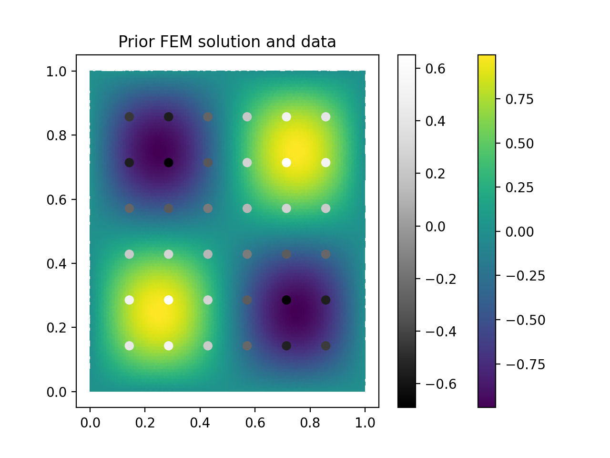

.. _tutorial:

Poisson's Equation Tutorial
===========================

This page provides an in-depth tutorial of the method applied to the
solution of Poisson's equation, a standard elliptic partial differential
equation that is often used as an introduction to FEM problems. The
tutorial illustrates how the equation would be solved in Firedrake,
and then creates some synthetic data that is then used to condition
the posterior solution to the FEM. Hyperparameter estimation is done
using Maximum Likelihood Estimation.

The full Python script can be found in the file `stat_fem/examples/poisson.py`.
We reproduce the relevant code here in the tutorial interspersed with the
text.

Poisson's Equation
---------------------

Poisson's Equation describes numerous phenomena, including heat diffusion,
electrostatics, and the deformation of elastic bodies. It is commonly
used as an example Elliptic Partial Differential Equation:

.. math::
   \nabla^2 u = -f

:math:`u` here is the function that we wish to determine, which might
represent the temperature in a 2D material. The function :math:`f` is the
external forcing, which is the local heat provided to the material at the
given spatial location. The function is specified over the unit square,
and the boundary conditions are assumed to be Dirichlet BCs,
which set the values of the function at the boundaries (here assumed to be 0).
We will assume that the function :math:`f` has the form

.. math::
   f(x,y) = 8 \pi^2 \sin\left(2\pi x \right) \sin\left(2\pi y \right)

This has been conveniently chosen such that the analytical solution to the
PDE is

.. math::
   u(x,y) = \sin\left(2\pi x \right)\sin\left(2\pi y\right)

which can be verified satisfies the BCs and the original governing Equation.

Solution with the Finite Element Method
---------------------------------------

To solve this problem using FEM, we must first convert to the weak form,
which we do by multiplying by a test function :math:`v` and integrate over
the entire domain of interest :math:`\Omega`. We use the standard FEM procedure of
integrating by parts to transform the Laplacian Operator :math:`\nabla^2`
into a dot product of gradients, and remove the surface integral term
due to the boundary conditions:

.. math::
   \int_\Omega \nabla u \cdot \nabla v \; dxdy = \int_\Omega fv \; dxdy

We also need to specify a mesh subdividing the unit square into the
subdomains over which we will approximate the function. Here we will
use a triangular mesh and piecewise linear functions.

To solve this problem using Firedrake, we can use the built-in
``UnitSquareMesh``, write out the above mathematical expression for the
FEM in the Unified Form Language, set the boundary conditions,
assemble the FEM, and then solve the PDE.

.. literalinclude:: ../../stat_fem/examples/poisson.py
   :lines: 1-38

Under the hood, Firedrake uses this information to assemble the linear
system that we need to solve by creating the sparse matrix ``A``
representing the bilinear operator and the RHS vector ``b`` representing
the forcing. This is a fairly straightforward operation using Firedrake.
Once we have the linear system, we can create a Firedrake ``Function``
to hold the solution and then call the ``solve`` function, which will use
the PETSc library to solve the system. If any of this
is not clear, please consult the Firedrake documentation and examples
for more guidance.

Data-Conditioned Solution to Poisson's Equation
-----------------------------------------------

We will now create some synthetic data that will not perfectly match
our prior FEM solution, and use the Statistical FEM to compute the updated
posterior solution. First we generate some data with known statistical errors

.. literalinclude:: ../../stat_fem/examples/poisson.py
   :lines: 40-72

Here, ``y`` is the fake data, which has some statistical errors
associated with it, and also differs from the true solution via
a multiplicative scaling factor ``rho`` and a specified covariance
``sigma_eta`` and a spatial correlation scale ``l_eta``.
We also have a covariance scale ``sigma_f`` and correlation length
``l_f`` that describes the imperfect knowledge we have about the forcing
function :math:`f`.

To find the posterior FEM solution, we can use the ``stat-fem`` library.
We have already created the stiffness matrix ``A`` and the RHS vector
``b`` when we assembled the FEM, but we also need to represent our
uncertainty in the forcing with a ``ForcingCovariance`` object and
a ``ObsData`` object.

.. literalinclude:: ../../stat_fem/examples/poisson.py
   :lines: 85-95

The ``ForcingCovariance`` object holds the Sparse Matrix that represents
the covariance matrix of the forcing using the PETSc library, and the
``ObsData`` object holds the information on the data, including the
values, the spatial location of the measurements, and the statistical
errors associated with those measurements.

Before we can compute the posterior solution, we need to determine how
well we expect the data to match the solution. This is known as
Model Discrepancy, which might represent missing physics in the FEM model
or some calibration factor needed to match the data to the FEM solution.
In some cases, we might have some prior knowledge of how well we expect
the FEM to reproduce reality, while in others we may just want to use the
data to estimate the mismatch so that we can use our model to predict
things. In this case, we will estimate the parameters directly, as
we have synthetic data that we know does not perfectly match.
``stat-fem`` has a built-in function for this, which will take
a stiffness matrix, RHS vector, forcing covariance matrix, and data, and
returns a ``LinearSolver`` object that has its model discrepancy parameters
fit using Maximum Likelihood Estimation:

.. literalinclude:: ../../stat_fem/examples/poisson.py
   :lines: 97-106

From there, we can compute the mean posterior solution and determine
its covariance:

.. literalinclude:: ../../stat_fem/examples/poisson.py
   :lines: 108-124

The script also makes some plots if Matplotlib is installed. These are
reproduced below to show the expected output of the calculations if
all works as expected.

   Prior FEM solution (color) and synthetic data points (greyscale circles)
   to the Poisson's Equation problem. Note the mismatch between the
   color scales for the prior solution and the data.

   Posterior FEM solution (color) and variance at data observation
   points (greyscale circles) to the Poisson's Equation problem. Note
   that the color scale has changes, indicating that the posterior
   is now scaled to correctly match the data,
   and that the uncertainties are smallest close to the boundaries
   (where the solution values are most certain due to the known
   values at the boundaries), and largest at the center further
   away.

